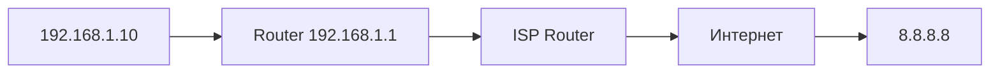
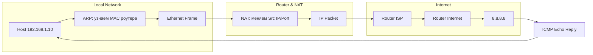
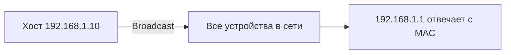

# 🌐 Полный разбор: инкапсуляция на примере ICMP (OSI)

## 📌 Что происходит

Когда ты выполняешь:

```bash
ping 8.8.8.8
```

Создаётся **ICMP Echo Request**, который проходит через все уровни модели OSI:

```text
L7 → L6 → L5 → L4 → L3 → L2 → L1
```

---

# 📦 PDU по уровням

| Уровень | PDU                |
| ------- | ------------------ |
| L7–L5   | Data               |
| L4      | (нет для ICMP)     |
| L3      | Packet (IP + ICMP) |
| L2      | Frame              |
| L1      | Bits               |

---

# ⬇️ Инкапсуляция (по шагам)

---

## 🔷 L7–L5 (Application / Presentation / Session)

```text
[ Data ]
ping payload (например: abcdefgh...)
```

---

## 🔷 L4 (Transport)

📌 ВАЖНО:
ICMP **не использует TCP/UDP**, поэтому этот уровень пропускается

---

## 🔷 L3 (Network) — IP + ICMP

### 📦 Общая структура

```text
+-------------+----------------------+----------------------+
| IP Header   | ICMP Header          | ICMP Payload         |
| (20-60 байт)| (8 байт)             | (данные)             |
+-------------+----------------------+----------------------+
```

---

## 🔷 Структура IP Header

```text
+--------+--------+----------------+-----------------------------+
| Version| IHL    | DSCP/ECN       | Total Length                |
+--------+--------+----------------+-----------------------------+
| Identification                | Flags | Fragment Offset         |
+------------------------------+-------+-------------------------+
| TTL         | Protocol       | Header Checksum                |
+-------------+----------------+-------------------------------+
| Source IP Address                                         |
+----------------------------------------------------------+
| Destination IP Address                                    |
+----------------------------------------------------------+
```

---

### 📌 Ключевые поля IP

* **TTL** — уменьшается на каждом hop
* **Protocol = 1** → ICMP
* **Source IP / Destination IP** — не меняются по пути

---

## 🔷 Структура ICMP Header

```text
+--------+--------+----------------+
| Type   | Code   | Checksum       |
+--------+--------+----------------+
| Identifier      | Sequence       |
+-----------------+----------------+
```

---

### 📌 Для ping

* Type = 8 → Echo Request
* Type = 0 → Echo Reply

---

## 🔷 L2 (Data Link) — Ethernet

```text
+-----------------+-----------------+-----------+-------------+----------------------+----------------------+---------------+
| Dest MAC (6B)   | Src MAC (6B)    | EtherType | IP Header   | ICMP Header          | ICMP Payload         | FCS (4 байта) |
+-----------------+-----------------+-----------+-------------+----------------------+----------------------+---------------+
```

📌 Важно:

* MAC назначения = **next hop (роутер)**
* MAC меняется на каждом hop

---

## 🔷 L1 (Physical)

```text
101010101010101010...
```

👉 Передача в виде сигналов

---

# 📊 Полная вложенность

```text
Ethernet Frame
└── IP Packet
    └── ICMP Message
        └── Data
```

---

# 🔍 Как это выглядит в Wireshark

```text
Frame
└── Ethernet II
    └── Internet Protocol (IPv4)
        └── ICMP
            └── Data
```

---

## 🔬 Пример (Wireshark)

```text
Internet Protocol Version 4
    Source: 192.168.1.10
    Destination: 8.8.8.8
    TTL: 64
    Protocol: ICMP (1)

Internet Control Message Protocol
    Type: 8 (Echo Request)
    Code: 0
    Identifier: 1
    Sequence: 1
```

---

# 🔬 HEX (реальный пакет)

```text
45 00 00 54 1c 46 40 00 40 01 a6 ec c0 a8 01 0a 08 08 08 08
08 00 f7 ff 00 01 00 01 61 62 63 64
```

---

## 📌 Разбор

```text
45 → Version + IHL
00 → DSCP
00 54 → Length
1c 46 → ID
40 00 → Flags/Fragment
40 → TTL
01 → Protocol (ICMP)
a6 ec → Checksum
c0 a8 01 0a → Source IP
08 08 08 08 → Destination IP

08 → Type (Echo Request)
00 → Code
f7 ff → Checksum
00 01 → Identifier
00 01 → Sequence
```

---

# ⬆️ Деинкапсуляция

```text
1. L1 → получаем биты
2. L2 → проверка CRC → убираем Ethernet
3. L3 → проверка IP → убираем IP header
4. ICMP → обрабатывается (ping)
5. Данные передаются приложению
```

---

# ⚠️ Важные выводы

## ✅ 1. ICMP работает на L3

* не использует TCP/UDP
* нет портов

---

## ✅ 2. Инкапсуляция = "матрёшка"

```text
[ Ethernet ]
    [ IP ]
        [ ICMP ]
            [ Data ]
```

---

## ✅ 3. Адресация

* IP → от источника до получателя
* MAC → только до следующего узла

---

## ✅ 4. TTL и ICMP

Если TTL = 0:

```text
ICMP Type 11 → Time Exceeded
```

---

## ✅ 5. Проверки

* L2 → CRC
* L3 → checksum (IPv4 header)
* ICMP → checksum

---

# 🧾 Финальный итог

ICMP-пакет в сети выглядит так:

```text
+-----------------+
| Ethernet Frame  |
|  +-----------+  |
|  | IP Packet |  |
|  |  +------+ |  |
|  |  | ICMP | |  |
|  |  +------+ |  |
|  +-----------+  |
+-----------------+
```

---
```термины смотреть ниже```
# 1️⃣ ARP — Address Resolution Protocol

## 📌 Зачем нужен ARP

* IP-адрес нужен для маршрутизации (L3)
* Ethernet работает с MAC-адресами (L2)
* ARP связывает IP ↔ MAC

---

## 🔹 Процесс ARP

1. Хост хочет отправить пакет на IP `192.168.1.1`
2. Проверяет локальный ARP-кэш: если MAC найден → используется
3. Если нет → отправляется **ARP Broadcast**:

```text
"Who has 192.168.1.1? Tell 192.168.1.10"
```

4. Хост с IP `192.168.1.1` отвечает:

```text
"192.168.1.1 is at aa:bb:cc:dd:ee:ff"
```

5. MAC сохраняется в ARP cache для будущих пакетов

---

## 🔹 Структура ARP-запроса

```text
+-----------------+-----------------+-------------------------+
| Dest MAC        | Src MAC         | ARP Request             |
| ff:ff:ff:ff:ff:ff (broadcast)        |                         |
+-----------------+-----------------+-------------------------+
```

## 🔹 Структура ARP-ответа

```text
+-----------------+-----------------+-------------------------+
| Dest MAC        | Src MAC         | ARP Reply               |
| 11:22:33:44:55:66                   |                         |
+-----------------+-----------------+-------------------------+
```

---

# 2️⃣ Routing — как пакет идёт через сеть

## 📌 Основная идея

* IP-адрес указывает **пункт назначения**, но не **следующий hop**
* Роутеры используют **routing table** и **longest prefix match**

---

## 🔹 Пример

Хост 192.168.1.10 хочет отправить пакет на 8.8.8.8

```text
Routing Table на хосте:
0.0.0.0/0       192.168.1.1     eth0
192.168.1.0/24  directly        eth0
```

1. IP `8.8.8.8` не в 192.168.1.0/24 → отправка на **default gateway 192.168.1.1**
2. Через ARP узнаём MAC роутера
3. Отправка Ethernet-кадра роутеру
4. Роутер пересылает дальше по таблице маршрутизации

---

## 🔹 Схема маршрута



---

# 3️⃣ ICMP — контроль и диагностика сети

## 📌 Ping (Echo)

* **Echo Request (Type 8)** отправляется к хосту
* **Echo Reply (Type 0)** приходит обратно

---

## 🔹 Структура пакета ICMP

```text
+-------------+----------------------+----------------------+
| IP Header   | ICMP Header          | Data                 |
+-------------+----------------------+----------------------+
```

### ICMP Header

```text
+--------+--------+----------------+
| Type   | Code   | Checksum       |
+--------+--------+----------------+
| Identifier      | Sequence       |
+-----------------+----------------+
```

---

## 🔹 Traceroute

Использует **TTL**:

1. TTL=1 → первый роутер → ICMP Type 11 (Time Exceeded)
2. TTL=2 → второй роутер → ICMP Type 11
3. … до назначения


---

# 4️⃣ NAT — Network Address Translation

## 📌 Проблема

* Частные IP (192.168.x.x) **не маршрутизируются в интернете**

---

## 🔹 Решение

* NAT заменяет **частный IP + порт** на **публичный IP + порт**
* Важно для IPv4

---

## 🔹 Пример

```text
До NAT:
Src IP: 192.168.1.10:50000
Dst IP: 8.8.8.8:53

После NAT:
Src IP: 1.2.3.4:40000
Dst IP: 8.8.8.8:53
```

---

## 🔹 Таблица NAT (PAT)

```text
192.168.1.10:50000 → 1.2.3.4:40000
192.168.1.11:50001 → 1.2.3.4:40001
```

---

## 🔹 Важные выводы

* NAT ломает end-to-end связь
* Все внутренние IP видны только роутеру
* Часто используется PAT → разные внутренние порты на один публичный IP

---

# 🧩 Полный поток пакета в сети



---

# 🔎 Честные выводы

1. **ARP** — L2 ↔ L3, критически нужен для MAC
2. **Routing** — только выбор следующего hop, IP остаётся тем же
3. **ICMP** — диагностика, TTL, ping, traceroute
4. **NAT** — скрытие внутренних IP, обязательный костыль IPv4


---

# 1️⃣ Broadcast

## 📌 Определение

**Broadcast** — это способ отправки пакета **всем устройствам в одной локальной сети (L2)**.

* MAC-адрес: `ff:ff:ff:ff:ff:ff` → все сетевые карты в сегменте принимают кадр
* Используется, когда отправитель **не знает точный MAC** получателя

---

## 🔹 Примеры использования

1. **ARP Request**

   * "Кто имеет IP 192.168.1.1? Сообщите 192.168.1.10"
   * Отправляется как broadcast → все устройства получают, только нужное отвечает

2. **DHCP Discover**

   * Клиент ищет DHCP-сервер → отправляет broadcast

---

## 🔹 Схема



---

# 2️⃣ Hop (маршрутизатор)

## 📌 Определение

**Hop** — это **один промежуточный узел (роутер)**, через который проходит пакет от источника к получателю.

* Пример: хост → домашний роутер → ISP → интернет → сервер
* Каждый переход через роутер = **1 hop**

---

## 🔹 Схема


* Здесь пакет прошёл **3 hop**: R1, R2 и сервер

---

# 3️⃣ Routing Table (таблица маршрутизации)

## 📌 Определение

**Routing table** — это **список правил**, который использует устройство для выбора **следующего hop** для IP-пакета.

---

## 🔹 Пример

| Destination    | Gateway     | Interface |
| -------------- | ----------- | --------- |
| 192.168.1.0/24 | directly    | eth0      |
| 0.0.0.0/0      | 192.168.1.1 | eth0      |

* **192.168.1.0/24** → локальная сеть → пакет отправляется напрямую
* **0.0.0.0/0** → default route → пакет идёт на шлюз

---

# 4️⃣ Longest Prefix Match

## 📌 Определение

Когда несколько маршрутов совпадают по IP, выбирается **самый точный маршрут**, то есть **с наибольшим количеством бит в маске сети**.

* Пример:

```text
Маршруты:
1) 10.0.0.0/8 → RouterA
2) 10.1.0.0/16 → RouterB
Пакет: 10.1.2.3
Выбирается → 10.1.0.0/16 (RouterB)
```

* Это важно, чтобы пакеты шли **по наиболее специфическому пути**

---

# 5️⃣ Ethernet Frame (Ethernet кадр)

## 📌 Определение

**Ethernet Frame** — это единица данных на **канальном уровне (L2)**.

---

## 🔹 Структура Ethernet Frame

```text
+-----------------+-----------------+--------------------+------------------+
| Dest MAC (6B)   | Src MAC (6B)    | EtherType (2B)     | Payload          |
+-----------------+-----------------+--------------------+------------------+
| FCS (4B) CRC    |
+-----------------+
```

* **Dest MAC** → адрес получателя
* **Src MAC** → адрес отправителя
* **EtherType** → какой протокол находится в payload (IPv4, ARP, IPv6…)
* **Payload** → данные (IP-пакет или ARP-запрос)
* **FCS** → контрольная сумма кадра

---

## 🔹 Пример ARP Broadcast

```text
+-----------------+-----------------+----------+---------------------+------+
| ff:ff:ff:ff:ff:ff | 11:22:33:44:55:66 | 0x0806 | ARP Request         | CRC  |
+-----------------+-----------------+----------+---------------------+------+
```

* Отправляется **всем устройствам сети**

---

# ✅ Краткий вывод

| Термин                   | Суть                                                   |
| ------------------------ | ------------------------------------------------------ |
| **Broadcast**            | Отправка всем в локальной сети (MAC ff:ff:ff:ff:ff:ff) |
| **Hop**                  | Один промежуточный узел, через который проходит пакет  |
| **Routing Table**        | Таблица для выбора следующего hop                      |
| **Longest Prefix Match** | Выбирается маршрут с самой точной маской сети          |
| **Ethernet Frame**       | Единица передачи на L2 (MAC, EtherType, Payload, FCS)  |

---
